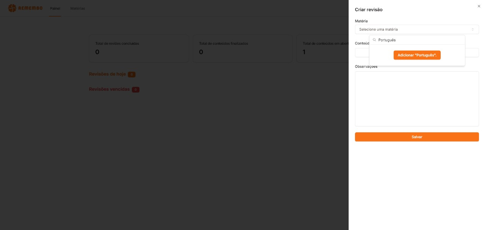

# Remembo

_Remembo: It's a project from my undergraduate final project. It consists of an application to assist in the memorization of study content based on the spaced repetition technique."_


- [Remembo](#remembo)
  - [How to run](#how-to-run)
  - [How to use and functionalities](#how-to-use-and-functionalities)
  - [Some images](#some-images)
  - [License](#license)

## How to run

1. Install .NET 8, Node.JS and MySQL 5.7

2. Clone the repository

3. Run the database creation script located in `DATABASE` folder

4. Go to `backend/src/Remembo.Api/appsettings.json` and replace `[YOUR_DB_DEFAULT_CONNECTION]` with your database connection string and `[YOUR_JWT_KEY]` with your JWT key

5. Run the command bellow in `backend/src/Remembo.Api` folder

```bash
dotnet build
dotnet run
```

6. Go to `FRONTEND` folder and configure the `.env` file. Replace `[YOUR_REMEMBO_API_URL]` with your API URL

7. Run the commands bellow in `FRONTEND` folder

```bash
npm install
npm run dev
```

## How to use and functionalities

## Some images

User registration

Login

Dashboard

Side panel for creating subject

Side panel for creating content and review

Dashboard with notification

Review details


## License

Distributed under the MIT License. See `LICENSE` for more details.
