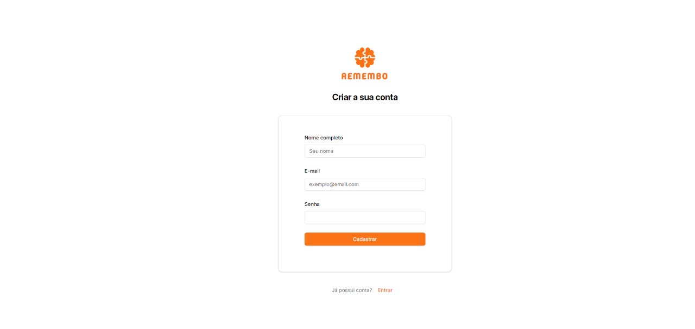

#  Remembo

_Remembo: It's a project from my undergraduate final project. It consists of an application to assist in the memorization of study content based on the spaced repetition technique."_


- [ Remembo](#-remembo)
  - [How to run](#how-to-run)
  - [How to use and functionalities](#how-to-use-and-functionalities)
  - [Some images of Remembo](#some-images-of-remembo)
    - [User registration](#user-registration)
    - [Login](#login)
    - [Dashboard](#dashboard)
    - [Side panel for creating subject](#side-panel-for-creating-subject)
    - [Side panel for creating content and review](#side-panel-for-creating-content-and-review)
    - [Dashboard with notification](#dashboard-with-notification)
    - [Review details](#review-details)
  - [Upcoming Features](#upcoming-features)
  - [License](#license)

## How to run

1. Install .NET 8, Node.JS and MySQL 5.7

2. Clone the repository

3. Run the database creation script located in `DATABASE` folder

4. Go to `backend/src/Remembo.Api/appsettings.json` and replace `[YOUR_DB_DEFAULT_CONNECTION]` with your database connection string and `[YOUR_JWT_KEY]` with your JWT key

5. Run the command bellow in `backend/src/Remembo.Api` folder

```bash
dotnet build
dotnet run
```

6. Go to `FRONTEND` folder and configure the `.env` file. Replace `[YOUR_REMEMBO_API_URL]` with your API URL

7. Run the commands bellow in `FRONTEND` folder

```bash
npm install
npm run dev
```

## How to use and functionalities

1. Create your login
2. Log into the application
3. After login, you will see your dashboard
4. Click the button open the side panel to create a new content with a new review. If you don’t have any subjects registered, you can register them on the same screen
   > The system will automatically create the first review with due date within 24 hours
5. When you complete a review, you can mark it as done
   > The system will automatically create the next review

<br/>

_Ps.: The algorithm is based on Ebbinghaus's forgetting curve and uses spaced repetition based on the data from this forgetting curve. There will be a total of 3 review to complete a content. The first review is created when the content is entered and is due within 24 hours. After completing the first review, the next one will be scheduled for 7 days later. After completing the second review, the third will be set for 30 days after the second. Once the third review is completed, the content will be fully reviewed._

## Some images of Remembo

### User registration



### Login


### Dashboard


### Side panel for creating subject


### Side panel for creating content and review


### Dashboard with notification


### Review details


## Upcoming Features

- Unit Tests
- Email verification for users
- Deployment
- Routes and screens will be created for editing and deleting content and subjects
- Review notifications will be implemented using a message broker
- Logs
- ...

## License

Distributed under the MIT License. See `LICENSE` for more details.
